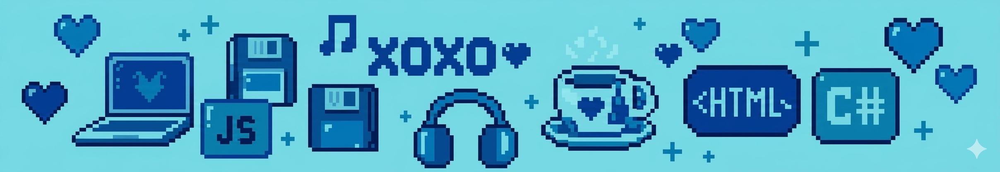

  

  <h1>Javier R.</h1>

  
<b>Desarrolladora Frontend|Backend · Creativa con enfoque técnico · Amante del diseño minimalista</b>

   

  
  
  

### Bases de Datos y Herramientas

  
  
  
  
  
  
  
  
  
  
  
  
  
  
  
  
  
  

  

	<a href="https://github.com/piyushsuthar/github-readme-quotes"> 

